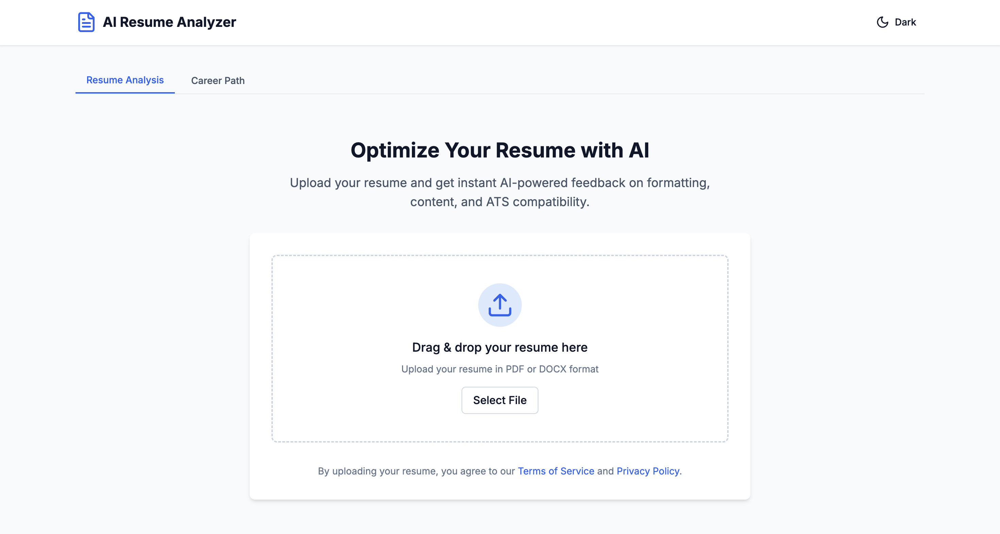
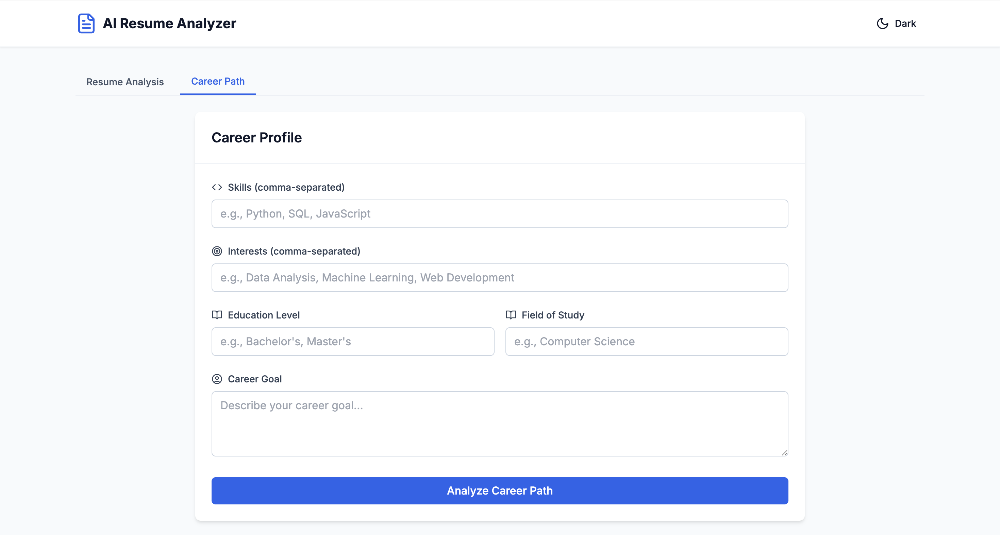

Here’s a well-structured, modern, and stylish README.md for your AI Resume Analyser project. It includes badges, sections, usage instructions, and contribution guidelines — all designed to impress:

⸻


# 🧠 AI Resume Analyser

[](LICENSE)
[](https://github.com/Pathuz21/ai_resume_analyser/issues)
[](https://github.com/Pathuz21/ai_resume_analyser/network/members)
[](https://github.com/Pathuz21/ai_resume_analyser/stargazers)

🚀 A smart web application that analyses resumes using Artificial Intelligence and NLP to evaluate job readiness, highlight missing skills, and match candidates to job descriptions effectively.

---

## ✨ Features

- 🔍 **Resume Parsing** – Extracts and cleans data from uploaded resumes (PDF/DOCX)
- 🧠 **AI Analysis** – Uses NLP to match resumes with job descriptions
- 📊 **Skill Gap Detection** – Identifies missing technical & soft skills
- 💡 **Feedback System** – Gives actionable suggestions to improve resumes
- 📄 **PDF Resume Viewer** – View parsed data and original PDF side by side
- 🌐 **Modern UI** – Built with React + Tailwind for a clean, responsive design

---

## 📸 Screenshots

| Resume Upload | Resume Analysis |
|---------------|------------------|
|  |  |

---

## 🛠️ Tech Stack

**Frontend**
- React.js ⚛️
- Tailwind CSS 🎨
- React-PDF 🧾

**Backend**
- Python 🐍
- Flask 🔥
- NLP Libraries (spaCy, NLTK) 🧠

**Other**
- GitHub Actions (CI/CD) ⚙️
- Docker (optional) 🐳

---

## 🚀 Getting Started

### 1. Clone the Repo

```bash
git clone git@github.com:Pathuz21/ai_resume_analyser.git
cd ai_resume_analyser

2. Frontend Setup

cd client
npm install
npm run dev

3. Backend Setup

cd server
pip install -r requirements.txt
python app.py


⸻

📂 Project Structure

ai_resume_analyser/
├── client/           # React frontend
│   └── src/
│       └── components/
├── server/           # Flask backend
│   ├── resume_parser.py
│   └── app.py
├── screenshots/      # App UI previews
└── README.md


⸻
```
🧪 API Endpoints

Method	Endpoint	Description
POST	/upload_resume	Upload and parse a resume
POST	/analyze	Analyze resume with JD
GET	/results	Fetch AI results


⸻

🙋‍♂️ How It Works
	1.	User uploads a resume
	2.	App parses content using NLP
	3.	Job description is compared to resume
	4.	Skill gaps and suggestions are generated
	5.	Final score and tips shown to user

⸻

🧠 AI / NLP Behind The Scenes
	•	Tokenization, Named Entity Recognition
	•	Cosine similarity between JD & Resume
	•	TF-IDF vectorization
	•	Custom skill matcher with preloaded tech stacks

⸻

✅ To Do
	•	Add authentication 🔐
	•	Save user analysis history 💾
	•	Resume formatting suggestions ✍️
	•	Dark mode 🌙

⸻

🤝 Contributing

Contributions are welcome! Here’s how to get started:
	1.	Fork the repo
	2.	Create your feature branch: git checkout -b my-feature
	3.	Commit your changes: git commit -m 'Add awesome feature'
	4.	Push to the branch: git push origin my-feature
	5.	Open a pull request ✅

⸻

📄 License

This project is licensed under the MIT License. See the LICENSE file for details.

⸻

🌟 Show Your Support

If you like this project, ⭐ star it on GitHub and share it with your peers!

⸻

📬 Contact

Maintainer: Pathuz21
📧 Email: yourname@example.com
🔗 LinkedIn: linkedin.com/in/yourname

⸻

Built with ❤️ for students, recruiters, and developers who want smarter hiring tools.

---

Would you like me to create a `README.md` file and push it to your repo? Or do you want a simpler version?
